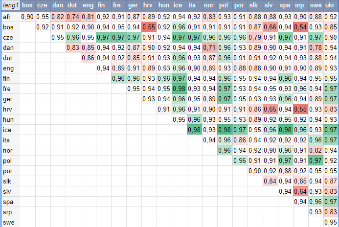

# LanguageGuesser
This project implements an artificial neural network which can be used to determine which language a word is from. The
model was implemented using Tensorflow. The data folder contains word lists from (mostly) european languages, currently 
there are 22 languages available.

## How it works

### File preparation

*This step can be skipped since the word lists are already generated and simply serves as documentation*

Using file_preparer.py, the files from the Leipzig Corpora Collection (see [Sources](#sources)) can be converted into 
files containing a single word per line.
Words that are too short or too long are filtered out as well as words containing letters that don't appear in the 
language's alphabet. This step is important since the word lists were generated using news articles, which often 
contain words and phrases from different languages. Wikipedia is a good starting point to find out which languages 
use which letters.

### Using a word as input

Since neural networks take a (numeric) vector of some size as input, we need to convert the words into such vectors. 
For that, we specify a max amount of letters per word and then generate a vector of size
> size_of_word_vector = number_of_different_letters * max_letters_per_word

So the vector consists of max_letters blocks of length num_letters (in our case, 123). Each of those blocks represents 
a letter of the word using a kind of one-hot code: If the fifth letter of a word is 'a', then the first entry (since 
the index of 'a' in config.alphabet is 0) in the fifth block becomes 1 and all the others 0.

### Training the network

LanguageDetector.py provides a command line interface allowing the user to select the languages the model should train 
with. After training is complete, the user can type in words to see what language the model thinks the word is from. 
In general, the model performs worse the more languages are compared at once.

## Results

Pair-wise comparison of all languages yields some interesting results:

The values shown in the table above are the accuracy of the model when being trained on two languages. This value can 
be interpreted as some kind of "distinctness" of the languages:
A high value (close to 1) means the model was able to correctly identify nearly every word, while a low value (close
to 0.5) means the model performs no better than simply guessing.
This can be observed when comparing Bosnian, Croatian and Serbian: Due to basically being the same language, the model 
performs only marginally better than guessing. The similarities between the continental Scandinavian languages, Danish, 
Swedish and Norwegian, can be seen clearly as well as the connection between Afrikaans and the Dutch language.

Please note that the result from this model are not suitable for further linguistic analysis since the quality and 
scope of the word lists can vary greatly from language to language. 
## Sources

The word lists used were created using the Leipzig Corpora Collection, provided under the Creative Commons License CC 
BY-NC by Universität Leipzig / Sächsische Akademie der Wissenschaften / InfAI.: https://wortschatz.uni-leipzig.de/en/

http://recherche-redaktion.de/sprachen/paneurop.htm was used to get a list of all letters used in european languages

The Ukrainian and Serbian word lists were transcribed into Latin alphabet with the help of: 
https://www.lexilogos.com/keyboard/ukrainian_conversion.htm and 
https://www.lexilogos.com/keyboard/serbian_conversion.htm